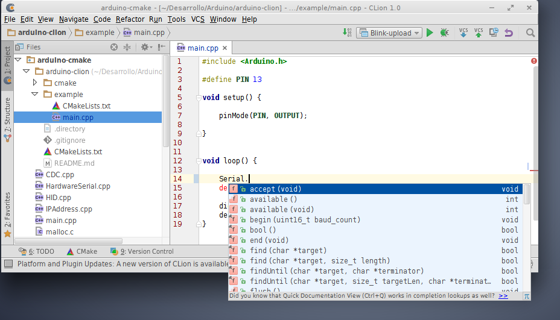

# CLion

**[CLion][1]** es el IDE desarrollado por **JetBrains** para programación en C/C++. Ofrece todas las características
esperadas de un entorno de programación de alta calidad así como un potente autocompletado de código que facilita
el desarrollo y aumenta la productividad.

Desgraciadamente, su integración con Arduino no es trivial. Una opción es utilizar el proyecto base _[Arduino CLion][2]_.

**Arduino CLion** es una configuración base para poder programar Arduino con CLion de forma sencilla.

Está basado en el proyecto [arduino-cmake][3] con algunos ajustes en el CMakeList.txt para funcionar correctamente.

## Configuración

Tendremos que configurar apenas unas opciones de nuestro proyecto, que será el nombre de la carpeta con el código,
en este caso `example` y posteriormente cambiar (si no lo hace solo) la línea 13 del CMakeLists.txt con el nuevo nombre.

En `example/CMakeLists.txt` también tendremos que configurar el nombre de nuestro proyecto, el modelo de Arduino y
el puerto.

**No** es necesario añadir todos los ficheros de nuestro proyecto, basta con incluir el _main_.

## Problemas

### No funciona nada

**Arduino-cmake** solo funciona con las versiones **1.0.x de Arduino**, asegúrate que estás usando una versión de esta rama.

Si tienes varias versiones instaladas, puedes editar el fichero `cmake/ArduinoToolchain.cmake` para que coja solo el que quieres.
Recuerda hacer un _clean_ (`Run-> Clean`) después para actualizar la cache de _cmake_.

### Al _subir_ el firmware da error _timeout_

Algunas placas, como la Leonardo o Micro Pro, necesitan entrar en _modo recuperación_ para poder ser reprogramadas,
para ello basta con ejecutar el fichero `cmake/reset.py` con la dirección del puerto de la placa y justo después hacer
upload. Ejemplo: `./reset.py /dev/ttyMCA0`

### No me autocompleta en los ficheros `.ino`

Al parecer, CLion no se lleva bien con los `.ino`, así que el fichero principal también deberá ser un `.cpp`. Si quieres
usar conjuntamente el Arduino IDE, una solución podría ser crear un _enlace simbólico_.

[1]: https://www.jetbrains.com/clion/
[2]: https://github.com/MiguelAngelLV/arduino-clion
[3]: https://github.com/queezythegreat/arduino-cmake
