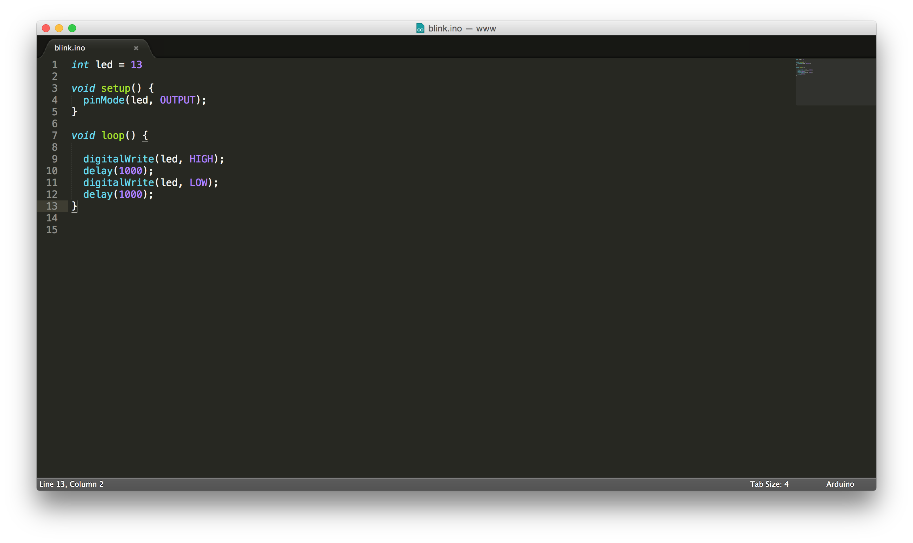

# Sublime Text

Sublime text es un editor de texto que trae muchas funcionalidades extras por medio de plugins como en este caso STINO; este plugin nos permite poder programar nuestras placas arduino por medio de una interfaz sencilla.

## Instalación

Para instalar STINO, podemos hacerlo de 2 maneras:

a. Usando Package Control:

1. Abrimos la pagina de instalacion de Package Control.
2. Copiamos el codigo de instalacion para nuestra versión de Sublime Text.
3. Abrimos Sublime Text y accedemos a la consola, desde el desplegable de la pestaña de Herramientas, una vez ahi pegamos el código de instalación y nos pedira reiniciar la aplicación.
4. Vamos al menú de *Opciones -> Package Control* dentro de Sublime Text.
En el dialogo de búsqueda introducimos package control install, seleccionamos la opción de _Install Package_.
5. Buscamos Arduino en el dialogo de búsqueda y veremos la opción de _Arduino Like IDE_.

b. Instalación Manual

1. [Descargamos como un ZIP](https://github.com/Robot-Will/Stino) y lo extraemos.
2. Nos vamos al menú de _preferencias_ en Sublime Text y buscamos la opción de Browse Packages.
3. Por último copiamos la carpeta extraiga de Stino en la carpeta de paquetes de Sublime Text.

## Configuración

Una vez hemos instalado el plugin, vamos a pasar a configurar el entorno. En cualquier caso, necesitaremos indicarle a STINO, donde se encuentran las librerias y herramientas del Arduino IDE.

1. Debemos ir al menu de preferencias de Sublime e indicar que queremos ver el menú de opciones de Arduino, que nos aparecera como una nueva pestaña.
2. Buscamos las opciones del menú de Arduino -> *Preferences -> Set Arduino Folder*, una vez aquí buscamos la ubicación de nuestra instalación de la IDE de Arduino. Si la ubicación es la correcta se nos mostrara un mensaje de confirmación indicando que la versión de Arduino ha sido encontrada en la carpeta.

Una vez configurado, podemos usar el menú extra llamado arduino para poder crear nuevos proyectos con los que programar con arduino. Entre otras características que trae, es que nos permite autocompletar código para nuestros proyectos con arduino.
